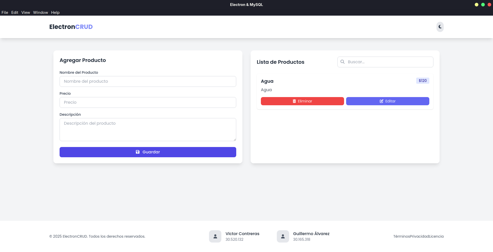

# Electron MySQL CRUD

Aplicación de escritorio construida con **Electron**, **MySQL** y **TailwindCSS** para la gestión de productos (CRUD). Permite agregar, editar, eliminar y listar productos en una base de datos MySQL, con una interfaz moderna y soporte para modo oscuro.



## Características

- CRUD de productos (nombre, precio, descripción)
- Interfaz moderna con TailwindCSS 
- Notificaciones de escritorio con Electron
- Modo oscuro
- Recarga automática en desarrollo

## Requisitos

- [Node.js](https://nodejs.org/) (v12 o superior recomendado)
- [MySQL](https://www.mysql.com/) (servidor local)
- npm (incluido con Node.js)

## Instalación

1. **Clona el repositorio:**
   ```sh
   git clone https://github.com/S-Gull/electron-mysql-crud.git
   cd electron-mysql-crud

   # CRUD de Productos con Electron y MySQL

Este es un proyecto de escritorio para gestionar productos (CRUD) utilizando Electron.js y MySQL como base de datos.

## Instalación

Sigue estos pasos para configurar y ejecutar el proyecto en tu entorno local.

### 1. Instala las dependencias:

Abre una terminal en la raíz del proyecto y ejecuta el siguiente comando para instalar todas las dependencias necesarias:

```bash
npm install
```

### 2. Configura la base de datos:

**Requisitos:**
* Asegúrate de tener un servidor MySQL en ejecución.

**Pasos:**
1.  Ejecuta el siguiente script SQL para crear la base de datos (`electron_mysql_crud`) y la tabla de productos (`products`):

    ```bash
    mysql -u root -p < app/database/db.sql
    ```

2.  Por defecto, la configuración de la base de datos se encuentra en `app/database/database.js` con las siguientes credenciales:
    * **Usuario:** `root`
    * **Contraseña:** `3690`

    Si tus credenciales de MySQL son diferentes, asegúrate de modificarlas en ese archivo.

## Uso

Una vez que las dependencias estén instaladas y la base de datos configurada, puedes iniciar la aplicación con el siguiente comando:

```bash
npm start
```

Esto abrirá una ventana de escritorio donde podrás crear, leer, actualizar y eliminar productos.

## Dependencias Principales

* [**electron**](https://www.electronjs.org/): Framework para crear aplicaciones de escritorio con tecnologías web.
* [**promise-mysql**](https://www.npmjs.com/package/promise-mysql): Un wrapper de `mysql` que utiliza Promises.
* [**mysql**](https://www.npmjs.com/package/mysql): Driver de MySQL para Node.js.
* [**tailwindcss**](https://tailwindcss.com/): Framework de CSS (utilizado vía CDN).
* [**electron-reload**](https://www.npmjs.com/package/electron-reload): Recarga automáticamente la aplicación durante el desarrollo.

## Estructura del Proyecto

```
electron-mysql-crud/
├── app/
│   ├── index.html
│   ├── css/
│   │   └── style.css
│   ├── database/
│   │   ├── database.js
│   │   └── db.sql
│   ├── js/
│   │   ├── app.js
│   │   ├── index.js
│   │   └── main.js
│   └── tailwind/
│       └── tailwind.config.js
├── package.json
└── README.md
```

## Créditos

Desarrollado por **Victor Contreras** y **Guillermo Álvarez**.

---

¡Contribuciones y sugerencias son bienvenidas!
